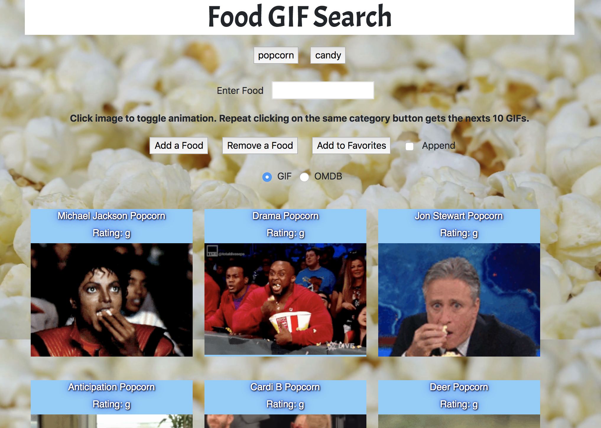

# Giphy

This application will take input from the user and will search the GIF or OMDB database.

## Description 

The application takes an input from the user, then creates a button for the user to click.  When the user clicks the button, results from the search are returned as either 10 GIFS or a movie poster.

### Usage instructions

User enters a search term and clicks "Add a Food" or "Add to Favorites" to create a "search button".  Each time a search button is clicked, if the GIF radial is selected, 10 GIFS are returned.  If the OMDB radial is pushed, a movie poster is returned.  If the same button is pushed again for the GIF database, 10 new GIFS are returned.

If the append button is pushed, the new GIFs are added to the top of the page.  Buttons can be removed by pressing the remove button.  If a button is added to favorites, it is saved in the browser so the buttons are available to the user across browser refreshes and closes.